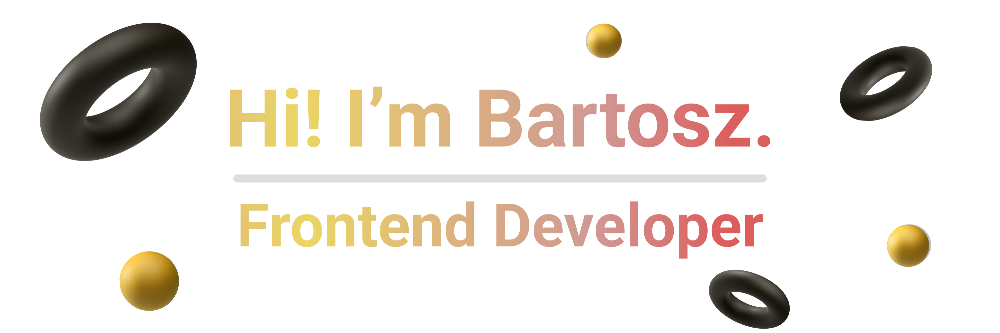

 
<h3 align="center">Educated as IT technician with specialized expertise in web development, operating systems, programming, and computer networks.</h3>
 

 
 🔭 I’m currently working on A **Netflix clone**
 
 🌱 I’m currently learning **Vue.js**
 

 

  

 
  
  
  <a href="https://bartekczrn.github.io/" target="_blank">
      <!-- sqlite, safari, google-chrome are other good icon options -->
  </a>

 
 
 

 
 

<h1 align="center">🌐 Languages, Frameworks and Tools 🌐</h1>
 

    
     
     

 
 
 

 
 

<h1 align=center>📁 My Projects 📁</h1>
 

 

 

 

 
 
 

 
 

<h1 align="center">📊 Stats 📊</h1>
 

  
   
   
  

 
 
 

